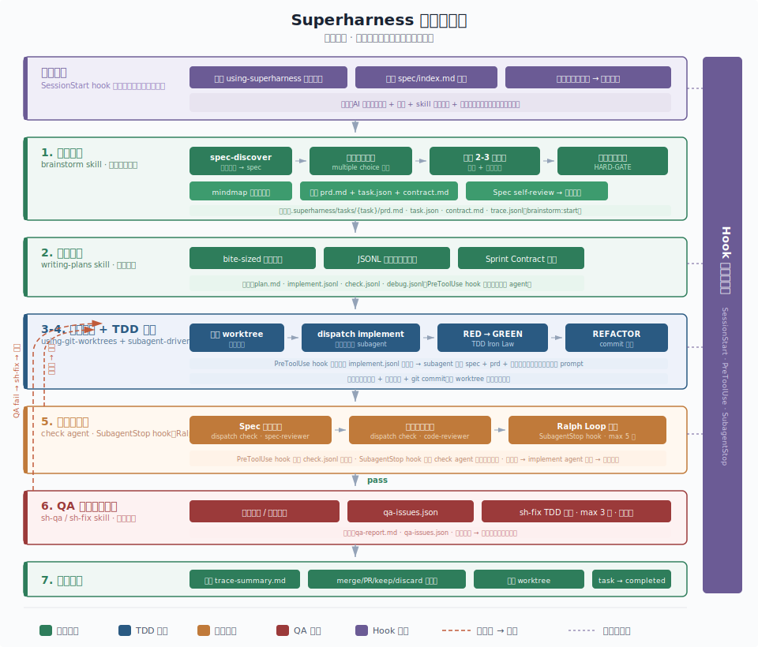

<h1 align="center">
  <strong>superharness</strong><br/>
</h1>

<p align="center">
  <a href="https://www.npmjs.com/package/superharness"></a>
  <a href="https://www.npmjs.com/package/superharness"></a>
  <a href="https://github.com/Mrlyk/superharness/blob/main/LICENSE"></a>
</p>

<p align="center">
  <a href="./README.md">English</a> &bull;
  <a href="#快速开始">快速开始</a> &bull;
  <a href="#多平台支持">多平台支持</a> &bull;
  <a href="#致谢与差异">致谢与差异</a>
</p>

<p align="center">
<sub>驾驭你的 AI 编码工具 &mdash; 与工具无关的软件工程工作流引擎</sub><br />
  <sub>支持 Claude Code、Cursor、Codex、Qoder、Aone Copilot、Gemini CLI、GitHub Copilot</sub>
</p>

## 概述

Superharness 不是又一个 AI 编码工具，而是**注入到 AI 工具中的工作流程序**。它让你选择的 AI 工具按照经过验证的软件工程纪律工作：需求澄清 → 任务拆解 → TDD 实现 → 双阶段审查 → QA 验收，全程自动化。

AI 编码工具很强大，但没有约束的强大是危险的：跳过测试、偏离需求、写出能跑但不可维护的代码、"完成"了但没人验证过。Superharness 把开发纪律变成机械强制的工作流，而不是靠 AI 自觉遵守的建议。

## 工作流程

<p align="center">
  
</p>

```
/superharness:go "做一个旅行规划 app"

  1. 头脑风暴 ── 逐个问题澄清需求，提出 2-3 种方案，用户确认设计
     （首次运行时自动扫描项目代码，生成基础规范到 .superharness/spec/）
  2. 任务拆解 ── 生成 bite-sized 任务（每个 2-5 分钟），完整代码，精确路径
  3. 隔离开发 ── 自动创建 git worktree，在独立分支上工作
  4. TDD 实现 ── 每个任务：写失败测试 → 写实现 → 测试通过 → 提交
  5. 双阶段审查 ── spec 合规审查 → 代码质量审查，不通过不往下走
  6. QA 验收 ── 调用外部 QA 服务（可选），发现问题自动修复
  7. 合并完成 ── 验证通过后合并 worktree，输出总结
```

整个过程由 AI 工具自主执行，你只需要在头脑风暴阶段参与决策。

**小改动不需要走这个流程。** Session-start hook 在每次 AI 会话启动时自动将项目规范和调度协议注入到上下文，AI 工具在任何对话中都会遵循这些规范。修一个 bug、调一个配置、改几行代码——直接说，不需要输入任何 superharness 命令。

## 快速开始

```bash
# 1. 安装
npm install -g superharness

# 2. 在项目中初始化（选择平台和规范模板）
superharness init --platforms claude-code --template frontend

# 3. 在 AI 工具中使用
/superharness:go "你的需求描述或需求链接"
```

<details>
<summary><strong>参数说明</strong></summary>

`--template` 可选值：

| 模板 | 适用场景 |
|------|---------|
| `frontend` | Web 前端项目 |
| `backend` | 后端 API 服务 |
| `ai-agent` | AI Agent 应用 |
| `fullstack` | 全栈项目 |
| `blank` | 空模板，自定义 |

`--platforms` 可选值：`claude-code`、`cursor`、`codex`、`qoder`、`aone-copilot`、`gemini`、`copilot`

多个平台用逗号分隔：`--platforms claude-code,cursor`

</details>

## 核心能力

### 三条铁律

Superharness 的核心是三条不可协商的规则，每条都预设了"合理化借口"的反驳，防止 AI 自我说服绕过规则。

| 铁律 | 规则 | 典型借口 / 反驳 |
|------|------|----------------|
| TDD | 没有失败测试就不写实现代码 | "太简单不用测试" / 简单代码也会坏，测试只要 30 秒 |
| 验证 | 没有新鲜验证证据就不声明完成 | "应该能过" / "应该"不是证据，运行命令 |
| 调试 | 没有根因调查就不尝试修复 | "先试着改改看" / 盲改只会浪费时间 |

### Spec 系统

项目规范不是一次性填写的静态文档，而是随项目演进持续更新的活文档。

- **spec-discover**（code → spec）：扫描 package.json、配置文件、代码结构 → 识别框架、状态管理、测试工具、API 风格等 → 用户确认后写入 `.superharness/spec/`
- **spec-update**（user → spec）：用户口头说"以后用 zustand"→ 转为描述式格式写入 spec → 下次 session 自动生效
- 只记录事实（"项目使用 zustand"），不发明规则（"必须使用 zustand"）

### Hook 三级体系

| Hook | 时机 | 作用 |
|------|------|------|
| SessionStart | 每次 AI 会话启动 | 注入调度协议 + spec 摘要 + 未完成任务恢复 |
| PreToolUse | 子 agent dispatch 前 | 按角色（implement/check/debug）注入对应 JSONL 上下文 |
| SubagentStop | check agent 完成时 | Ralph Loop：验证命令未通过或完成标记缺失则 block |

### QA 系统

Superharness 将 QA 从 AI 工具中分离出来——QA 由外部服务执行，通过文件协议串联整个流程。这是核心差异化设计：AI 写代码，外部系统评判质量，结构化文件契约连接两者。

**两个命令，一个闭环：**

```
/superharness:sh-qa     →  调用外部 QA 服务  →  写入 qa-issues.json
/superharness:sh-fix    →  读取 qa-issues.json  →  按 TDD 逐个修复  →  重跑 sh-qa
```

修复后仍有问题则循环继续（最多 3 轮）。回归问题自动提升 severity。3 轮用完或连续两次回归，剩余问题升级为人工介入。

**注册 QA 服务**，在 `.superharness/config.yaml` 中配置：

```yaml
qa:
  max_fix_rounds: 3        # 防振荡：每个 issue 最多修复轮次
  services:
    # 托管模式：POST 请求到服务端，服务自主设计用例
    - name: ai-agent-qa
      type: managed
      endpoint: http://localhost:8080

    # 自治模式：执行命令，读取结果文件
    - name: frontend-e2e
      type: autonomous
      command: npm run qa:e2e
      output: .superharness/tasks/{task}/qa-results-e2e.json
```

两种服务类型：
- **managed（托管）**—— Superharness 发送 POST 请求，附带任务上下文；服务端自主运行测试用例并返回结果
- **autonomous（自治）**—— Superharness 执行一条命令（如 E2E 测试套件），然后读取输出文件

**文件协议 — `qa-issues.json`：**

所有 QA 服务将结果写入任务目录下的统一 `qa-issues.json`。这是 QA 与修复之间的契约：

```json
[
  {
    "id": "qa-001",
    "severity": "critical",
    "category": "logic-error",
    "file": "src/planner/schedule.ts",
    "line": 42,
    "message": "Off-by-one: loop skips last day of trip",
    "fix_hint": "Change < to <= in the for-loop condition",
    "status": "pending",
    "fix_round": 0
  },
  {
    "id": "qa-002",
    "severity": "major",
    "category": "missing-validation",
    "file": "src/api/trips.ts",
    "line": 15,
    "message": "No input validation on date range — negative durations accepted",
    "fix_hint": "Add guard: if (end <= start) throw",
    "status": "pending",
    "fix_round": 0
  }
]
```

| 字段 | 类型 | 说明 |
|------|------|------|
| `id` | string | 唯一标识 |
| `severity` | `"critical"` \| `"major"` \| `"minor"` \| `"suggestion"` | 修复优先级顺序 |
| `category` | string | 问题分类（如 `logic-error`、`missing-validation`、`perf`） |
| `file` | string | 文件路径 |
| `line` | number | 行号 |
| `message` | string | 问题描述 |
| `fix_hint` | string | 修复建议 |
| `status` | `"pending"` \| `"fixed"` \| `"escalated"` | sh-fix 在修复过程中更新 |
| `fix_round` | number | 每次修复尝试 +1；超过 `max_fix_rounds` → escalated |

`sh-fix` 按 severity 顺序处理（critical → major → minor），每个 issue 走 TDD 流程（写失败测试 → 修复 → 验证），原地更新 `status` 和 `fix_round`，然后重跑 `sh-qa` 检查回归。suggestion 级别的问题不会自动修复。

### 中断恢复

AI 工具 context 满了或 session 断开时，代码不会丢（git worktree），进度不会丢（task.json）。Session-start hook 自动检测未完成任务，AI 在会话开始时主动询问是继续还是开始新任务。

### 可观测性

每个关键节点自动记录结构化日志到 `trace.jsonl`：

```bash
superharness trace --task .superharness/tasks/04-02-intent    # 执行路径摘要
superharness trace --diff task1 task2                          # 对比两个 task 的路径差异
```

## 项目结构

`superharness init` 在用户项目中创建 `.superharness/` 目录：

```
.superharness/
├── using-superharness.md             # 调度协议（session-start hook 注入）
├── config.yaml                       # 项目配置
├── workflow.md                       # 工作流概览（人类可读参考）
├── worktree.yaml                     # Worktree 配置
├── spec/                             # 项目规范（hook 自动注入 index.md）
│   ├── guides/index.md
│   └── {module}/index.md
├── tasks/                            # 任务管理
│   ├── .current-task                 # (gitignored) 当前任务指针
│   └── {MM}-{DD}-{name}/
│       ├── task.json                 # 状态、phase、sprint 进度
│       ├── prd.md                    # 需求文档
│       ├── contract.md               # Sprint Contract
│       ├── trace.jsonl               # 过程日志
│       ├── implement.jsonl           # 实现阶段上下文
│       ├── check.jsonl               # 审查阶段上下文
│       └── qa-issues.json            # QA issues
└── .gitignore                        # 排除运行时状态
```

## Skill 一览

| 分类 | Skill | 用途 |
|------|-------|------|
| 工作流 | `go` | 主入口：端到端工作流编排 |
| | `brainstorm` | 需求澄清 + Spec 自动发现 + 思维导图 |
| | `writing-plans` | 任务拆解：bite-sized 任务、完整代码 |
| | `subagent-driven-development` | 每任务新鲜 subagent + 双阶段审查 |
| | `using-git-worktrees` | 隔离开发环境 |
| | `finishing-a-development-branch` | merge/PR/keep/discard + trace 摘要 |
| 铁律 | `test-driven-development` | RED-GREEN-REFACTOR 循环 |
| | `verification-before-completion` | 无证据不声明完成 |
| | `systematic-debugging` | 根因优先 |
| QA | `sh-qa` | 调用外部 QA 服务，结果写入 `qa-issues.json` |
| | `sh-fix` | 读取 `qa-issues.json`，按 TDD 修复，完成后重跑 QA |
| 辅助 | `using-superharness` | 调度协议（session-start hook 注入） |
| | `spec-discover` | 扫描代码发现约定（brainstorm 自动调用，也可手动） |
| | `spec-update` | 用户口头指定约定，保存到 spec |
| | `mindmap` | 思维导图可视化（Markmap + WebSocket） |

## Agent 一览

| Agent | 用途 | 调度方式 |
|-------|------|---------|
| `implement` | 实现任务，遵循 TDD | `Task(subagent_type: "implement")` |
| `check` | 审查实现（spec 合规 / 代码质量） | `Task(subagent_type: "check")` |
| `debug` | 根因调试 | `Task(subagent_type: "debug")` |
| `research` | 只读调研 | `Task(subagent_type: "research")` |
| `code-reviewer` | 独立代码审查 | `superpowers:code-reviewer` |
| `spec-reviewer` | 独立 spec 合规审查 | 直接 invoke |

## CLI 命令

| 命令 | 用途 |
|------|------|
| `superharness init` | 初始化项目 + 复制 skill/agent/hook 到各平台目录 |
| `superharness sync` | spec/skill 变更后重新同步到各平台 |
| `superharness spec add` | 追加规范模板（monorepo） |
| `superharness task list` | 查看任务进度 |
| `superharness qa` | 调用外部 QA 服务 |
| `superharness status` | 当前状态 |
| `superharness trace` | 查看执行路径摘要 / 对比差异 |

## 多平台支持

一套 skill 源文件，`superharness init` 时按目标平台做格式转换和路径适配。

| 平台 | Skill 目录 | Agent 目录 | Hook 支持 |
|------|-----------|-----------|----------|
| Claude Code | `.claude/commands/superharness/` | `.claude/agents/` | SessionStart + PreToolUse + SubagentStop |
| Cursor | `.cursor/commands/` | `.cursor/agents/` | sessionStart + preToolUse + subagentStop |
| Aone Copilot | `.aone_copilot/skills/` | — | sessionStart + preToolUse + stop |
| Codex | `.codex/skills/` | — | — |
| Qoder | `.qoder/skills/` | — | — |
| Gemini CLI | `.gemini/commands/` (Phase 4) | — | BeforeTool + AfterResponse |
| GitHub Copilot | `~/.copilot/skills/` | — | 待确认 |

## 致谢与差异

Superharness 基于 [Superpowers](https://github.com/obra/superpowers)（MIT）深度改造，继承其 skill 体系和开发纪律，融合 [Trellis](https://github.com/Mindfold/trellis) 的工作流基础设施。

**继承自 Superpowers**：SKILL.md 格式、三条铁律（TDD / Verification / Debugging）、Brainstorm → Writing-plans → Subagent-driven-development 工作流、HARD-GATE、"合理化借口"反驳机制、双阶段审查。

**架构差异**：

| 维度 | Superpowers | Superharness |
|------|------------|-------------|
| 交付形态 | Claude Code plugin | npm 包 + CLI，平台无关 |
| 平台 | Claude Code 为主 | 7 个平台统一适配 |
| Hook | SessionStart 1 级 | SessionStart + PreToolUse + SubagentStop 3 级 |
| Agent | code-reviewer 1 个 | implement/check/debug/research + code-reviewer/spec-reviewer 6 个 |

**新增能力**：Spec 系统（spec-discover + spec-update）、PreToolUse JSONL 上下文自动注入、Ralph Loop（SubagentStop 防过早完成）、Task 系统（task.json + trace.jsonl + 中断恢复）、Markmap 思维导图、外部 QA 集成（托管/自治 + 防振荡）、Trace 可观测性。

**优化点**：Spec 审查从一开始用 inline self-review（Superpowers v5.0.6 才改为 inline）；Subagent dispatch 注册自定义 agent + hook 自动注入（Superpowers 用 general-purpose + 内联 prompt）；Visual Companion 替换为独立 mindmap skill。

## 技术栈

| 组件 | 技术 |
|------|------|
| 语言 | TypeScript / Node.js 20+ |
| CLI | commander |
| 构建 | tsup |
| 测试 | vitest |
| Hook | TS → tsup 编译 → node 执行 |

## 许可证

MIT License
