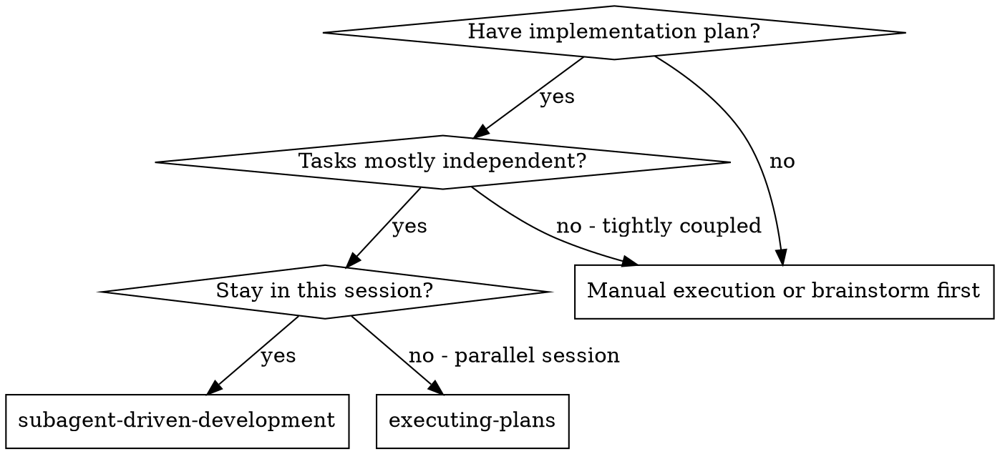
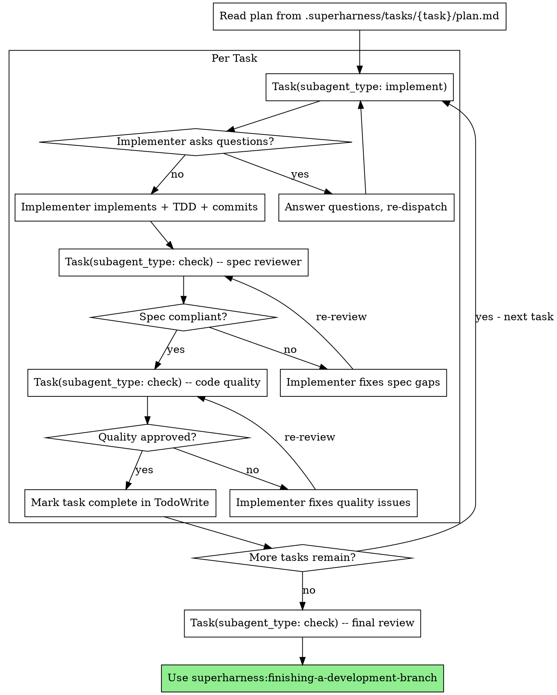

# Subagent-Driven Development

Execute plan by dispatching fresh subagent per task, with two-stage review after each: spec compliance review first, then code quality review.

**Why subagents:** You delegate tasks to specialized agents with isolated context. By precisely crafting their instructions and context, you ensure they stay focused and succeed at their task. They should never inherit your session's context or history -- you construct exactly what they need. This also preserves your own context for coordination work.

**Core principle:** Fresh subagent per task + two-stage review (spec then quality) = high quality, fast iteration

**Announce at start:** "I'm using the subagent-driven-development skill to execute tasks from the plan."

## When to Use



**vs. Executing Plans (parallel session):**
- Same session (no context switch)
- Fresh subagent per task (no context pollution)
- Two-stage review after each task: spec compliance first, then code quality
- Faster iteration (no human-in-loop between tasks)

## Hook Automation (No Manual Action Needed)

PreToolUse and SubagentStop hooks handle the following automatically in the background -- you do **NOT** need to do these manually:

- **Phase tracking**: task.json `phase` field updates automatically on each subagent dispatch (implement → check → complete)
- **Trace logging**: trace.jsonl events are written automatically on each phase transition
- **JSONL context injection**: PreToolUse hook reads the corresponding JSONL file (implement.jsonl / check.jsonl) and injects referenced file contents into the subagent prompt

Your only job: **dispatch subagents with the correct `subagent_type` parameter**.

## Dispatch Syntax

You **MUST** specify `subagent_type` when dispatching subagents. This is how hooks identify the agent type:

```
Task(
  subagent_type: "implement",
  prompt: "Full task text + scene-setting context"
)

Task(
  subagent_type: "check",
  prompt: "Review the implementation for spec compliance"
)
```

Available subagent_type values:
- `"implement"` -- Implementation agent (hook injects implement.jsonl context)
- `"check"` -- Review agent (hook injects check.jsonl context; SubagentStop hook runs Ralph Loop)
- `"debug"` -- Debug agent (hook injects debug.jsonl context)
- `"research"` -- Research agent (lightweight context, no active task required)

If you omit `subagent_type`, hooks will NOT inject JSONL context. The subagent will only have whatever you manually provide in the prompt.

## Cross-Platform Degradation

If context was NOT automatically injected (you don't see `--- .superharness/spec/ ---` markers in the subagent prompt), the current platform's hook doesn't support PreToolUse for Task/Agent tools. In this case, manually read the files listed in `.superharness/tasks/{task}/implement.jsonl` (or check.jsonl) and include their contents in the subagent prompt.

## The Process



## Model Selection

Use the least powerful model that can handle each role to conserve cost and increase speed.

**Mechanical implementation tasks** (isolated functions, clear specs, 1-2 files): use a fast, cheap model. Most implementation tasks are mechanical when the plan is well-specified.

**Integration and judgment tasks** (multi-file coordination, pattern matching, debugging): use a standard model.

**Architecture, design, and review tasks**: use the most capable available model.

**Task complexity signals:**
- Touches 1-2 files with a complete spec -> cheap model
- Touches multiple files with integration concerns -> standard model
- Requires design judgment or broad codebase understanding -> most capable model

## Handling Implementer Status

Implementer subagents report one of four statuses. Handle each appropriately:

**DONE:** Proceed to spec compliance review.

**DONE_WITH_CONCERNS:** The implementer completed the work but flagged doubts. Read the concerns before proceeding. If the concerns are about correctness or scope, address them before review. If they're observations (e.g., "this file is getting large"), note them and proceed to review.

**NEEDS_CONTEXT:** The implementer needs information that wasn't provided. Provide the missing context and re-dispatch.

**BLOCKED:** The implementer cannot complete the task. Assess the blocker:
1. If it's a context problem, provide more context and re-dispatch with the same model
2. If the task requires more reasoning, re-dispatch with a more capable model
3. If the task is too large, break it into smaller pieces
4. If the plan itself is wrong, escalate to the human

**Never** ignore an escalation or force the same model to retry without changes. If the implementer said it's stuck, something needs to change.

## Prompt Templates

- `./implementer-prompt.md` - Dispatch implementer subagent
- `./spec-reviewer-prompt.md` - Dispatch spec compliance reviewer subagent
- `./code-quality-reviewer-prompt.md` - Dispatch code quality reviewer subagent

## Example Workflow

```
You: I'm using the subagent-driven-development skill to execute tasks from the plan.

[Read plan file once: .superharness/tasks/04-03-auth-feature/plan.md]
[Extract all 5 tasks with full text and context]
[Create TodoWrite with all tasks]

Task 1: Hook installation script

[Dispatch: Task(subagent_type: "implement", prompt: "Task 1 full text + scene-setting context")]
# → PreToolUse hook auto-injects implement.jsonl context + updates phase + writes trace

Implementer: "Before I begin - should the hook be installed at user or system level?"
You: "User level (~/.config/superharness/hooks/)"

Implementer:
  - Implemented install-hook command
  - Added tests, 5/5 passing
  - Committed

[Dispatch: Task(subagent_type: "check", prompt: "Review Task 1 for spec compliance")]
# → hook auto-injects check.jsonl context
Spec reviewer: Spec compliant - all requirements met

[Dispatch: Task(subagent_type: "check", prompt: "Review Task 1 code quality")]
Code reviewer: Approved.
# → SubagentStop hook (Ralph Loop) checks verification markers, allows stop if all pass

[Mark Task 1 complete]

Task 2: Recovery modes

[Dispatch: Task(subagent_type: "implement", prompt: "Task 2 full text")]
Implementer:
  - Added verify/repair modes
  - 8/8 tests passing

[Dispatch: Task(subagent_type: "check", prompt: "Review Task 2 spec compliance")]
Spec reviewer: Issues:
  - Missing: Progress reporting
  - Extra: --json flag not requested

[Implementer fixes → re-dispatch check]
Spec reviewer: Spec compliant now

[Dispatch: Task(subagent_type: "check", prompt: "Review Task 2 code quality")]
Code reviewer: Issues: Magic number (100)

[Implementer fixes → re-dispatch check]
Code reviewer: Approved

[Mark Task 2 complete]

...

[After all tasks]
[Dispatch: Task(subagent_type: "check", prompt: "Final full code review")]
Final reviewer: All requirements met, ready to merge

Done! Invoke superharness:finishing-a-development-branch
```

## Advantages

**vs. Manual execution:**
- Subagents follow TDD naturally
- Fresh context per task (no confusion)
- Parallel-safe (subagents don't interfere)
- Subagent can ask questions (before AND during work)

**vs. Executing Plans:**
- Same session (no handoff)
- Continuous progress (no waiting)
- Review checkpoints automatic

**Efficiency gains:**
- No file reading overhead (controller provides full text)
- Controller curates exactly what context is needed
- Subagent gets complete information upfront
- Questions surfaced before work begins (not after)

**Quality gates:**
- Self-review catches issues before handoff
- Two-stage review: spec compliance, then code quality
- Review loops ensure fixes actually work
- Spec compliance prevents over/under-building
- Code quality ensures implementation is well-built

**Cost:**
- More subagent invocations (implementer + 2 reviewers per task)
- Controller does more prep work (extracting all tasks upfront)
- Review loops add iterations
- But catches issues early (cheaper than debugging later)

## Red Flags

**Never:**
- Start implementation on main/master branch without explicit user consent
- Skip reviews (spec compliance OR code quality)
- Proceed with unfixed issues
- Dispatch multiple implementation subagents in parallel (conflicts)
- Make subagent read plan file (provide full text instead)
- Skip scene-setting context (subagent needs to understand where task fits)
- Ignore subagent questions (answer before letting them proceed)
- Accept "close enough" on spec compliance (spec reviewer found issues = not done)
- Skip review loops (reviewer found issues = implementer fixes = review again)
- Let implementer self-review replace actual review (both are needed)
- **Start code quality review before spec compliance passes** (wrong order)
- Move to next task while either review has open issues
- Omit `subagent_type` when dispatching subagents (hooks won't inject context without it)

**If subagent asks questions:**
- Answer clearly and completely
- Provide additional context if needed
- Don't rush them into implementation

**If reviewer finds issues:**
- Implementer (same subagent) fixes them
- Reviewer reviews again
- Repeat until approved
- Don't skip the re-review

**If subagent fails task:**
- Dispatch fix subagent with specific instructions
- Don't try to fix manually (context pollution)

## Integration

**Required workflow skills:**
- **superharness:using-git-worktrees** - REQUIRED: Set up isolated workspace before starting
- **superharness:writing-plans** - Creates the plan this skill executes
- **superharness:finishing-a-development-branch** - Complete development after all tasks

**Subagents should use:**
- **superharness:test-driven-development** - Subagents follow TDD for each task

**Alternative workflow:**
- **superharness:executing-plans** - Use for parallel session instead of same-session execution
